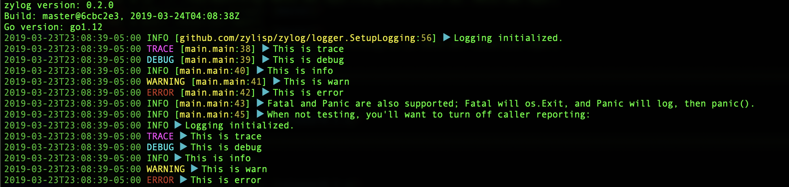

# zylog

*A simple wrapper for customized logrus usage*


## Setup

Here's an example of setting up global logging for use by your app in your
app's `logging` package, based on configuration pulled in by Viper (from either
a config file or ENV variables):


```go
package logging

import (
	cfg "github.com/spf13/viper"
	log "github.com/zylisp/zylog/logger"
)

func init() {
	log.SetupLogging(&log.ZyLogOptions{
		Colored:      cfg.GetBool("logging.colored"),
		Level:        cfg.GetString("logging.level"),
		Output:       cfg.GetString("logging.output"),
		ReportCaller: cfg.GetBool("logging.report-caller"),
	})
}
```


## Usage

The setup configures the logrus logger, so wherever you want to log, simply
use logrus as you would normally:

```go
...
import (
	log "github.com/sirupsen/logrus"
)
...
log.Info("You are standing in an open field west of a white house.")
...
```


There's some more example usage in the demo (`./cmd/zylog-demo/main.go`). To run it:

```bash
$ make build
$ ./bin/demo
```

At which point you should see something like the following:




## License

© 2019, ZYLISP Project

Apache License, Version 2.0
